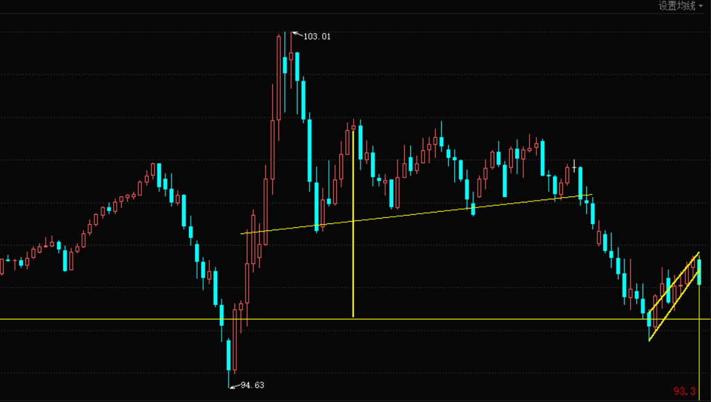
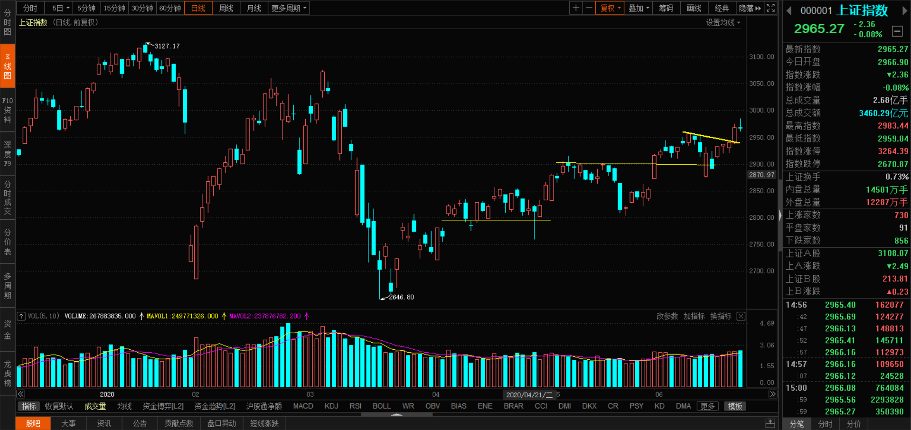
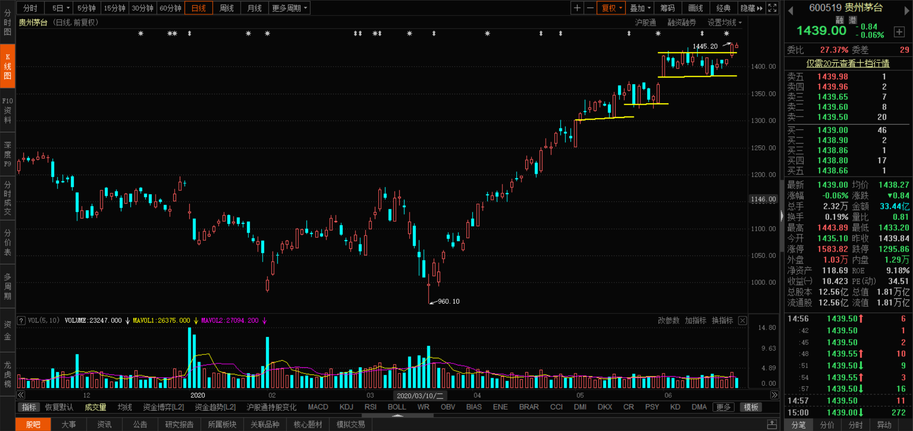
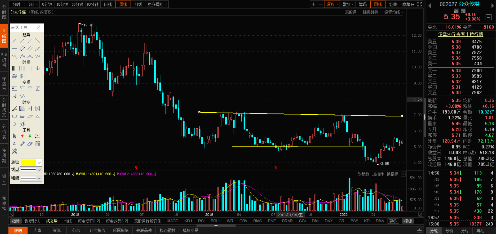
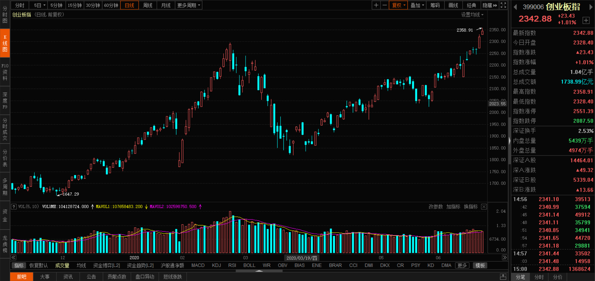
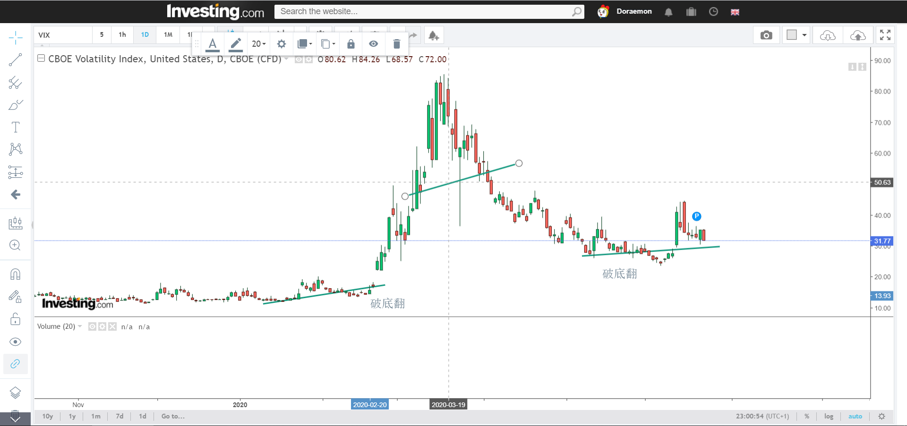

* 美元指数 出现上飘旗 不过跌幅满足到93.3能真的到吗? 美指到93.3 美股又会出股灾的

* 人民币继续假突破后转强 利好A股

* 上证指数 升了一个支撑 继续看好

* 茅台

* 分众传媒 周线破底翻 支撑会前箱体低点5元

* 创业板指 直线上涨 无形态 看3日低点支撑

* 国产芯片 突破

* 芯片etf 同上

* VIX

* 关于下个月指数调整 目前上证50指数失真严重 25%是银行 25%非银 15.6%的食品饮料还有茅台撑着 而实际涨幅都在创业板

* 黄金继续震荡 若拉回到1710可逢低买